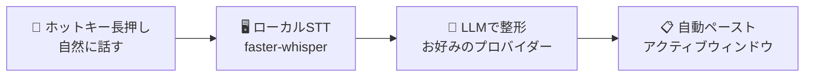

<div align="center">


# VOVOCI

**声に出して考えよう。話しながら磨き上げる。**

自然に話すだけで、整った構造化テキストがWindowsアプリに届きます — ローカルSTTとお好みのLLMで動作します。

[](https://github.com/lovemage/vovoci-packaging/releases)
[](./LICENSE)
[](https://github.com/lovemage/vovoci)
[](https://github.com/lovemage/vovoci-packaging/releases)

Languages: [English](README.md) | [繁體中文](README.zh-TW.md) | [简体中文](README.zh-CN.md) | [日本語](README.ja.md) | [한국어](README.ko.md)

</div>

## なぜ「構造化された音声入力」なのか？

話すことは、タイピングとは異なる思考回路を活性化させます — アイデアを探り、抜け漏れに気づき、リアルタイムで軌道修正できます。VOVOCIはその生の思考を整った構造化テキストに変換します。

- **話しながら考える** — 声に出すことで思考が外在化され、タイピングだけより速く脳が処理・整理できます
- **方向を修正する** — 自分の推論を声に出して聞き、おかしな点に気づき、文の途中でもアプローチを調整できます
- **あらゆる場面にそのまま使える** — 構造化された出力がIDE、エージェントプロンプト、メモ、チャットに直接流れます — 手直し不要です

## 仕組み



> ローカルで文字起こし。APIキーはあなた自身のもの。LLMステップまでデータは外部に送信されません — どのプロバイダーを信頼するかはあなたが選べます。

## 特長

| 💰 月額約$3.80 | 📖 用語スキャナー | 🌐 デュアルホットキー翻訳 |
|:---:|:---:|:---:|
| サブスクリプション不要。実際に使ったLLM APIトークン分だけお支払い。Grok 4.1 Fast（OpenRouter経由）でヘビーに毎日使っても月額約$3.80です。 | 内蔵プロンプトをAIエージェントにコピーするだけ — コードベースをスキャンして用語テーブルをエクスポートします。インポートすれば、すべての音声入力で正しいスペルが使われます。 | 翻訳用に2つ目のホットキーを割り当てられます。通常の音声入力キーの代わりにそのキーを押すと、VOVOCIが発話を自動的にターゲット言語に翻訳します。 |

## クイックスタート

### ポータブル版（推奨）

1. [Releases](https://github.com/lovemage/vovoci-packaging/releases/latest) から `VOVOCI-portable-0.1.4.zip` をダウンロード
2. 解凍して `Run-VOVOCI-First-Time.cmd` を実行
3. `VOVOCI.exe` を起動

> STTモデルは初回使用時に自動ダウンロードされます（インターネット接続が一度だけ必要）。以降はローカルにキャッシュされ、オフラインで再利用できます。

### ソースから実行

```powershell
git clone https://github.com/lovemage/vovoci.git
cd vovoci
python -m venv .venv && .venv\Scripts\activate
pip install -r requirements.txt
python app.py
```

## プロバイダー

VOVOCIは5つのLLMプロバイダーにすぐ対応しています — ロックインはありません。

**OpenAI Compatible** · **OpenRouter** · **Xiaomi MiMo** · **Google Gemini** · **NVIDIA NIM** *（無料枠あり）*

> LLM APIが初めての方は、NVIDIA NIMから始めるのがおすすめです — 無料でアクセスでき、クレジットカードも不要です。

## アプリのスクリーンショット


<div align="center">

🌐 [ウェブサイト](https://vovoci.com) · 📄 [Apache 2.0 License](./LICENSE)

</div>
