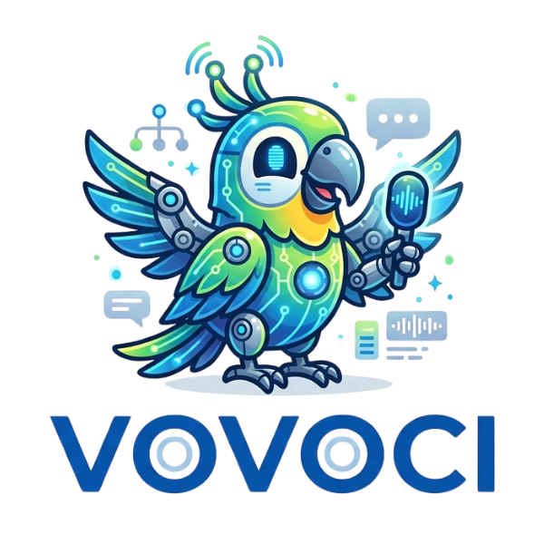
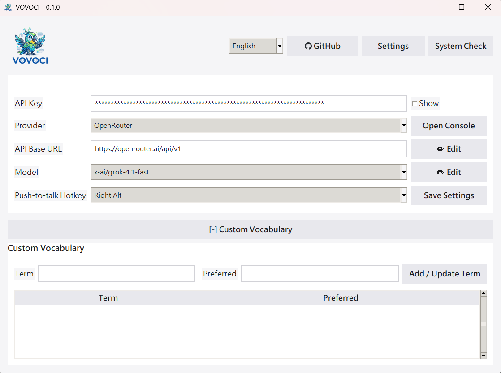

<div align="center">
  
  <h1>VOVOCI</h1>
  <p>Windows 向けの vibecoding と日常会話のための構造化音声秘書。</p>
</div>

言語: [English](https://github.com/lovemage/vovoci/blob/main/README.md#readme) | [繁體中文](https://github.com/lovemage/vovoci/blob/main/README.zh-TW.md#readme) | [简体中文](https://github.com/lovemage/vovoci/blob/main/README.zh-CN.md#readme) | [日本語](https://github.com/lovemage/vovoci/blob/main/README.ja.md#readme) | [한국어](https://github.com/lovemage/vovoci/blob/main/README.ko.md#readme)

## バージョン

現在のバージョン: `0.1.4`

## 概要

VOVOCI は音声をローカルの `faster-whisper` で文字起こしし、その後あなたが選んだ LLM で意味を構造化します。ユーザーの意図は変更しません。

## アプリ画面



## 特徴

- vibecoding、音声メモ、SNS 下書き、日常会話に対応
- Push-to-talk と Auto paste で Windows の各アプリに対応
- 混在言語入力と構造化出力をサポート
- 多言語 UI: English、繁體中文、日本語、한국어
- Provider: OpenAI-compatible、OpenRouter、Xiaomi MiMo、Google Gemini、NVIDIA NIM
- 録音ファイルは一時ファイルとして処理後に削除

## コアフロー

1. ホットキーを押して録音
2. ローカル STT（`faster-whisper`）で文字起こし
3. LLM で意味を構造化
4. 出力をアクティブなウィンドウへ貼り付け

## Quick Start

### 1) Windows ポータブル版（推奨）

1. [Releases](https://github.com/lovemage/vovoci/releases/latest) から `VOVOCI-portable-<version>.zip` をダウンロード
2. ZIP を展開
3. 最初に `Run-VOVOCI-First-Time.cmd` を実行し、その後 `VOVOCI.exe` を使う

注意: STT モデルは初回利用時に自動ダウンロードされます（初回のみネット接続が必要）。以後はローカルキャッシュでオフライン再利用できます。

### 2) Clone（ソースコード）

```powershell
git clone https://github.com/lovemage/vovoci.git
cd vovoci
```

### 3) Setup + Run

```powershell
python -m venv .venv
.venv\Scripts\activate
pip install -r requirements.txt
python app.py
```

## ライセンス

Apache 2.0。詳細は [LICENSE](./LICENSE) を参照してください。


