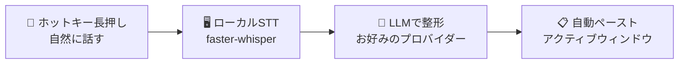

<div align="center">


# VOVOCI

**声に出して考えよう。話しながら磨き上げる。**

自然に話すだけで、整えられたテキストが使用中のデスクトップアプリに届きます — ローカルSTTとお好みのLLMで動作します。

[](https://github.com/lovemage/vovoci/releases)
[](./LICENSE)
[](https://github.com/lovemage/vovoci)
[](https://github.com/lovemage/vovoci/releases)

Languages: [English](README.md) | [繁體中文](README.zh-TW.md) | [简体中文](README.zh-CN.md) | [日本語](README.ja.md) | [한국어](README.ko.md)

</div>

## なぜ「構造化された音声入力」なのか？

話すことは、タイピングとは異なる思考回路を活性化させます — アイデアを探り、抜け漏れに気づき、リアルタイムで軌道修正できます。VOVOCIはその生の思考を整った構造化テキストに変換します。

- **話しながら考える** — 声に出すことで思考が外在化され、タイピングだけより速く脳が処理・整理できます
- **方向を修正する** — 自分の推論を声に出して聞き、おかしな点に気づき、文の途中でもアプローチを調整できます
- **あらゆる場面にそのまま使える** — 構造化された出力がIDE、エージェントプロンプト、メモ、チャットに直接流れます — 手直し不要です

## 仕組み


```mermaid
graph LR
    A[🎤 ホットキー長押し <br> 自然に話す] --> B[🖥️ ローカルSTT <br> faster-whisper]
    B --> C[🤖 LLMで整形 <br> お好みのプロバイダー]
    C --> D[📋 自動ペースト <br> アクティブウィンドウ]
```

> ローカルで文字起こし。APIキーはあなた自身のもの。LLMステップまでデータは外部に送信されません — どのプロバイダーを信頼するかはあなたが選べます。

## 特長

| 💰 API コストは任意 | 📖 用語スキャナー | 🪟 音声終了後の確認ウィンドウ |
|:---:|:---:|:---:|
| サブスクリプション不要。オンラインの有料 LLM API、無料枠のあるプロバイダー、またはローカルの OpenAI-compatible モデルサーバーを選べます。有料のネットワーク API 接続は必須ではありません。 | 内蔵プロンプトをAIエージェントにコピーするだけ — コードベースをスキャンして用語テーブルをエクスポートします。インポートすれば、すべての音声入力で正しいスペルが使われます。 | 音声終了時に確認ウィンドウを表示できます。左側に元の入力言語の文字起こし、右側に AI が再構成した意味内容を表示し、貼り付けやコピー前に確認できます。 |

## v0.1.7 の新機能

- **フローティング録音ボタン** — メインウィンドウをトレイへ閉じて `Show Button` を選択し、鳥アイコンを1回クリックして録音開始、もう1回クリックして停止・文字起こし・Refi を実行できます。
- **設定画面を保ったまま保存** — `Save Settings` は完了を表示し、設定を折りたたんだり History へ移動したりしません。
- **意図を保つ Refi** — 質問は質問、平叙文は平叙文のまま維持し、箇条書きは複数項目がある場合だけ使用します。
- **3プラットフォーム Release** — 1つの GitHub workflow で Windows、macOS、Linux パッケージを生成します。

## クイックスタート

### 配布パッケージ

| プラットフォーム | パッケージ | Release | 使い方 |
|:---|:---|:---|:---|
| Windows | `VOVOCI-portable-0.1.7.zip` または `VOVOCI-Setup-0.1.7.exe` | [vovoci/releases/latest](https://github.com/lovemage/vovoci/releases/latest) | ZIP を展開して初回起動ツールを実行するか、インストーラーを起動します。 |
| macOS | `VOVOCI-macOS-0.1.7-unsigned.dmg` | [vovoci/releases/latest](https://github.com/lovemage/vovoci/releases/latest) | `VOVOCI.app` を `Applications` に移動し、Gatekeeper の警告時は右クリックして「開く」を選びます。 |
| Linux x86_64 | `VOVOCI-Linux-0.1.7-x86_64.tar.gz` | [vovoci/releases/latest](https://github.com/lovemage/vovoci/releases/latest) | 展開して `VOVOCI/VOVOCI` を実行します。デスクトップ環境によっては入力補助ツールが必要です。 |

### メンテナー向けリリース手順

ローカル変更をリモート release とウェブサイトへ反映する場合は、次の手順を使います。

1. source の変更を `lovemage/vovoci` に commit して push します。`site/` と全言語の README を必ず含めます。
2. Cloudflare Pages が push された branch の `site/` から静的サイトをデプロイする設定になっていることを確認します。未設定の場合は Cloudflare dashboard から Pages deploy を手動実行します。
3. 対応する version tag（例: `v0.1.7`）を push するか、`release` workflow を `release_version=0.1.7` で手動実行します。
4. Workflow は `APP_VERSION` の確認、テスト、3プラットフォームのビルドを行い、`lovemage/vovoci` Releases に公開します。
5. Windows installer/portable ZIP、macOS DMG、Linux x86_64 archive が Release にあることと、`https://vovoci.com` が最新サイトを表示することを確認します。

### ポータブル版（推奨）

1. [Releases](https://github.com/lovemage/vovoci/releases/latest) から `VOVOCI-portable-0.1.7.zip` をダウンロード
2. 解凍して `Run-VOVOCI-First-Time.cmd` を実行
3. `VOVOCI.exe` を起動

> STTモデルは初回使用時に自動ダウンロードされます（インターネット接続が一度だけ必要）。以降はローカルにキャッシュされ、オフラインで再利用できます。

### ソースから実行

```powershell
git clone https://github.com/lovemage/vovoci.git
cd vovoci
python -m venv .venv && .venv\Scripts\activate
pip install -r requirements.txt
python app.py
```

## プロバイダー

VOVOCIは6つのLLMプロバイダーにすぐ対応し、ローカルの OpenAI-compatible モデルサーバーも使えます — ロックインはありません。

**OpenAI Compatible** · **OpenRouter** · **Xiaomi MiMo** · **Google Gemini** · **NVIDIA NIM** *（無料枠あり）* · **Local Model**

> 独自のローカル大規模モデルサーバーがある場合は、Local Model を選択し、API Base URL、モデル名、サーバーが必要とする場合のみ API Key を入力してください。これにより、有料オンライン API を必須にせずローカルモデルを利用できます。

## アプリのスクリーンショット


<div align="center">

🌐 [ウェブサイト](https://vovoci.com) · 📄 [Apache 2.0 License](./LICENSE)

</div>
