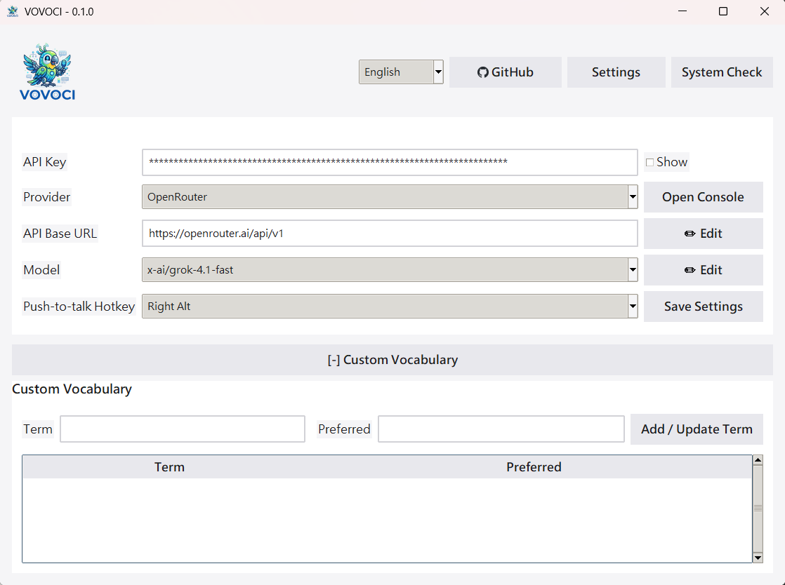

<div align="center">


# VOVOCI

**말로 생각하고, 말하면서 다듬어가세요.**

자연스럽게 말하면, 깔끔하게 정리된 텍스트가 Windows 앱에 바로 입력됩니다 — 로컬 STT와 원하는 LLM으로 구동됩니다.

[](https://github.com/lovemage/vovoci-packaging/releases)
[](./LICENSE)
[](https://github.com/lovemage/vovoci)
[](https://github.com/lovemage/vovoci-packaging/releases)

Languages: [English](README.md) | [繁體中文](README.zh-TW.md) | [简体中文](README.zh-CN.md) | [日本語](README.ja.md) | [한국어](README.ko.md)

</div>

## 왜 구조화된 음성인가요?

말하기는 다른 종류의 사고를 활성화합니다 — 아이디어를 탐색하고, 빈틈을 발견하고, 실시간으로 방향을 수정할 수 있습니다. VOVOCI는 그 날것의 사고를 깔끔하고 구조화된 결과물로 바꿔줍니다:

- **말하면서 생각합니다** — 음성은 생각을 외부로 꺼내어, 타이핑만 할 때보다 뇌가 더 빠르게 처리하고 다듬을 수 있게 도와줍니다
- **방향을 조정합니다** — 자신의 추론을 소리 내어 들으면서, 어긋난 부분을 찾아내고 문장 도중에도 접근 방식을 수정할 수 있습니다
- **어디든 바로 적용합니다** — 구조화된 결과물이 IDE, 에이전트 프롬프트, 메모, 채팅 등 어디든 바로 흘러들어갑니다 — 후처리가 필요 없습니다

## 작동 방식


> 로컬 음성 인식. 본인의 API 키 사용. LLM 단계 전까지 데이터가 외부로 나가지 않으며 — 어떤 프로바이더를 신뢰할지는 직접 선택합니다.

## 주요 특징

| 💰 API 비용 선택 가능 | 📖 용어 스캐너 | 🪟 음성 종료 후 검토 창 |
|:---:|:---:|:---:|
| 구독료 없음. 유료 온라인 LLM API, 무료 티어 제공자, 또는 로컬 OpenAI-compatible 모델 서버를 선택할 수 있습니다. 유료 네트워크 API 연결은 필수가 아닙니다. | 내장된 프롬프트를 AI 에이전트에 복사하면, 코드베이스를 스캔하여 용어 테이블을 추출합니다. 이를 가져오면 모든 음성 입력에서 정확한 맞춤법이 적용됩니다. | 음성이 끝나면 검토 창을 띄울 수 있습니다. 왼쪽에는 원래 입력 언어의 전사문, 오른쪽에는 AI가 재구성한 의미 내용이 표시되어 붙여넣기나 복사 전에 확인할 수 있습니다. |

## 빠른 시작

### 배포 패키지

| 플랫폼 | 패키지 | Release | 사용 방법 |
|:---|:---|:---|:---|
| Windows | `VOVOCI-portable-0.1.6.zip` | [vovoci-packaging/releases/latest](https://github.com/lovemage/vovoci-packaging/releases/latest) | 압축을 풀고 `Run-VOVOCI-First-Time.cmd`를 실행한 뒤 `VOVOCI.exe`를 시작합니다. |
| macOS | `VOVOCI-macOS-0.1.6-unsigned.dmg` | [vovoci-packaging/releases/latest](https://github.com/lovemage/vovoci-packaging/releases/latest) | DMG를 열어 `VOVOCI.app`을 `Applications`로 옮기고, 첫 실행 때 Gatekeeper 경고가 나오면 앱을 우클릭해 `열기`를 선택합니다. |

### 메인테이너 릴리스 절차

로컬 변경 사항을 원격 release 와 웹사이트에 반영할 때는 다음 절차를 사용합니다.

1. source 변경 사항을 `lovemage/vovoci` 에 commit 하고 push 합니다. `site/` 와 모든 언어의 README 를 반드시 포함합니다.
2. Cloudflare Pages 가 push 된 branch 의 `site/` 에서 정적 사이트를 배포하도록 설정되어 있는지 확인하거나, Cloudflare dashboard 에서 Pages deploy 를 수동으로 실행합니다.
3. `lovemage/vovoci-packaging` 의 `release` workflow 를 실행하고, `source_ref` 에 push 된 branch 또는 tag, `release_version` 에 `0.1.6` 를 입력합니다.
4. `package_windows=true`, `package_macos=true`, `publish_release=true` 를 유지하여 GitHub Actions 로 Windows 및 macOS artifacts 를 빌드하고 게시합니다. Linux package 는 이 workflow 에서 게시하지 않습니다. Linux 지원은 현재 로컬에서 source/Python app 방식으로 테스트 완료되었습니다.
5. Workflow 완료 후 GitHub Release 에 `VOVOCI-Setup-0.1.6.exe`, `VOVOCI-portable-0.1.6.zip`, `VOVOCI-macOS-0.1.6-unsigned.dmg` 가 있는지 확인하고, `https://vovoci.com` 이 최신 정적 사이트를 표시하는지 확인합니다.

### 포터블 (권장)

1. [Releases](https://github.com/lovemage/vovoci-packaging/releases/latest)에서 `VOVOCI-portable-0.1.6.zip`을 다운로드합니다
2. 압축을 풀고 `Run-VOVOCI-First-Time.cmd`를 실행합니다
3. `VOVOCI.exe`를 실행합니다

> STT 모델은 첫 사용 시 자동 다운로드됩니다(인터넷 1회 필요). 이후 로컬에 캐시되어 오프라인으로 재사용할 수 있습니다.

### 소스에서 실행

```powershell
git clone https://github.com/lovemage/vovoci.git
cd vovoci
python -m venv .venv && .venv\Scripts\activate
pip install -r requirements.txt
python app.py
```

## 프로바이더

VOVOCI는 여섯 가지 LLM 프로바이더를 기본 지원하며 로컬 OpenAI-compatible 모델 서버도 사용할 수 있습니다 — 특정 서비스에 종속되지 않습니다.

**OpenAI Compatible** · **OpenRouter** · **Xiaomi MiMo** · **Google Gemini** · **NVIDIA NIM** *(무료 티어)* · **Local Model**

> 자체 로컬 대형 모델 서버가 있다면 Local Model을 선택하고 API Base URL, 모델 이름, 서버가 요구하는 경우에만 API Key를 입력하세요. 이를 통해 유료 온라인 API를 강제하지 않고 로컬 모델을 사용할 수 있습니다.

## 앱 스크린샷



<div align="center">

🌐 [웹사이트](https://vovoci.com) · 📄 [Apache 2.0 라이선스](./LICENSE)

</div>
