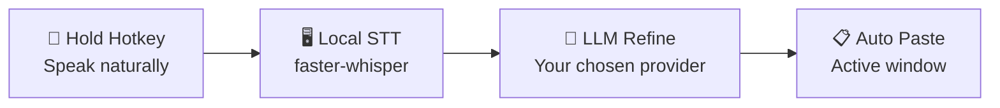

<div align="center">


# VOVOCI

**Voice Your Thoughts. Refine as You Go.**

Speak naturally, get clean structured text in any Windows app — powered by local STT and your choice of LLM.

[](https://github.com/lovemage/vovoci-packaging/releases)
[](./LICENSE)
[](https://github.com/lovemage/vovoci)
[](https://github.com/lovemage/vovoci-packaging/releases)

Languages: [English](README.md) | [繁體中文](README.zh-TW.md) | [简体中文](README.zh-CN.md) | [日本語](README.ja.md) | [한국어](README.ko.md)

</div>

## Why Structured Voice?

Speaking activates a different kind of thinking — you explore ideas, catch gaps, and course-correct in real time. VOVOCI turns that raw thinking into clean, structured output so you can:

- **Think while you speak** — voice externalizes your thoughts, helping your brain process and refine faster than typing alone
- **Steer your direction** — hear your own reasoning out loud, spot what's off, and adjust your development approach mid-sentence
- **Ship to any context** — structured output flows directly into your IDE, agent prompt, note, or chat — no cleanup needed

## How It Works



> Local transcription. Your API key. No data leaves your machine until the LLM step — and you choose which provider to trust.

## Highlights

| 💰 ~$3.80/month | 📖 Term Scanner | 🌐 Dual-Hotkey Translation |
|:---:|:---:|:---:|
| No subscription. You only pay for LLM API tokens you actually use. Heavy daily usage on Grok 4.1 Fast via OpenRouter costs ~$3.80/mo. | Copy a built-in prompt into your AI agent — it scans your codebase and exports a vocabulary table. Import it, and every dictation uses the right spelling. | Assign a second hotkey for translation. Press it instead of the regular dictation key, and VOVOCI translates your speech into your target language automatically. |

## Quick Start

### Portable (Recommended)

1. Download `VOVOCI-portable-0.1.4.zip` from [Releases](https://github.com/lovemage/vovoci-packaging/releases/latest)
2. Extract and run `Run-VOVOCI-First-Time.cmd`
3. Launch `VOVOCI.exe`

> STT models auto-download on first use (internet required once), then cached locally for offline reuse.

### From Source

```powershell
git clone https://github.com/lovemage/vovoci.git
cd vovoci
python -m venv .venv && .venv\Scripts\activate
pip install -r requirements.txt
python app.py
```

## Providers

VOVOCI works with five LLM providers out of the box — you're never locked in.

**OpenAI Compatible** · **OpenRouter** · **Xiaomi MiMo** · **Google Gemini** · **NVIDIA NIM** *(free tier)*

> New to LLM APIs? Start with NVIDIA NIM — free access, no credit card needed.

## App Screenshot


<div align="center">

🌐 [Website](https://vovoci.com) · 📄 [Apache 2.0 License](./LICENSE)

</div>
