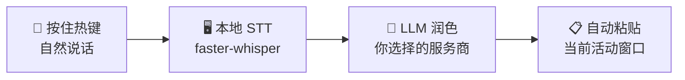

<div align="center">


# VOVOCI

**开口即思考，边说边打磨。**

自然说话，在任意 Windows 应用中获得干净的结构化文本 — 由本地 STT 和你选择的 LLM 驱动。

[](https://github.com/lovemage/vovoci/releases)
[](./LICENSE)
[](https://github.com/lovemage/vovoci)
[](https://github.com/lovemage/vovoci/releases)

Languages: [English](README.md) | [繁體中文](README.zh-TW.md) | [简体中文](README.zh-CN.md) | [日本語](README.ja.md) | [한국어](README.ko.md)

</div>

## 为什么要用结构化语音？

说话会激活一种不同的思维方式 — 你会探索想法、发现漏洞，并实时纠正方向。VOVOCI 把这些原始思考转化为干净、结构化的输出，让你可以：

- **边说边想** — 语音将思维外化，帮助大脑比单纯打字更快地处理和打磨想法
- **随时调整方向** — 听到自己的推理过程，发现哪里不对，在说到一半时就修正思路
- **直达任何场景** — 结构化输出直接流入你的 IDE、Agent 提示词、笔记或聊天窗口 — 无需二次整理

## 工作原理



> 本地转录，你自己的 API Key。在 LLM 环节之前数据不会离开你的电脑 — 而且你可以选择信任哪个服务商。

## 亮点

| 💰 约 $3.80/月 | 📖 术语扫描器 | 🌐 双热键翻译 |
|:---:|:---:|:---:|
| 无需订阅。你只为实际使用的 LLM API tokens 付费。通过 OpenRouter 使用 Grok 4.1 Fast 重度日用约 $3.80/月。 | 将内置提示词复制到你的 AI Agent 中 — 它会扫描你的代码库并导出词汇表。导入后，每次听写都能使用正确的拼写。 | 分配第二个热键用于翻译。按下它代替常规听写键，VOVOCI 会自动将你的语音翻译成目标语言。 |

## 快速开始

### 便携版（推荐）

1. 从 [Releases](https://github.com/lovemage/vovoci/releases/latest) 下载 `VOVOCI-portable-0.1.4.zip`
2. 解压并运行 `Run-VOVOCI-First-Time.cmd`
3. 启动 `VOVOCI.exe`

> STT 模型在首次使用时自动下载（需要联网一次），之后缓存到本地可离线复用。

### 从源码运行

```powershell
git clone https://github.com/lovemage/vovoci.git
cd vovoci
python -m venv .venv && .venv\Scripts\activate
pip install -r requirements.txt
python app.py
```

## 服务商

VOVOCI 开箱即用支持五个 LLM 服务商 — 绝不锁定。

**OpenAI Compatible** · **OpenRouter** · **Xiaomi MiMo** · **Google Gemini** · **NVIDIA NIM** *（免费额度）*

> LLM API 新手？从 NVIDIA NIM 开始 — 免费使用，无需信用卡。

## 应用截图


<div align="center">

🌐 [官网](https://vovoci.com) · 📄 [Apache 2.0 License](./LICENSE)

</div>
