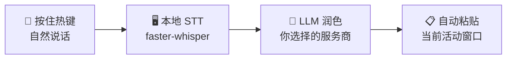

<div align="center">


# VOVOCI

**开口即思考，边说边打磨。**

自然说话，在任意 Windows 应用中获得干净的结构化文本 — 由本地 STT 和你选择的 LLM 驱动。

[](https://github.com/lovemage/vovoci-packaging/releases)
[](./LICENSE)
[](https://github.com/lovemage/vovoci)
[](https://github.com/lovemage/vovoci-packaging/releases)

Languages: [English](README.md) | [繁體中文](README.zh-TW.md) | [简体中文](README.zh-CN.md) | [日本語](README.ja.md) | [한국어](README.ko.md)

</div>

## 为什么要用结构化语音？

说话会激活一种不同的思维方式 — 你会探索想法、发现漏洞，并实时纠正方向。VOVOCI 把这些原始思考转化为干净、结构化的输出，让你可以：

- **边说边想** — 语音将思维外化，帮助大脑比单纯打字更快地处理和打磨想法
- **随时调整方向** — 听到自己的推理过程，发现哪里不对，在说到一半时就修正思路
- **直达任何场景** — 结构化输出直接流入你的 IDE、Agent 提示词、笔记或聊天窗口 — 无需二次整理

## 工作原理


```mermaid
graph LR
    A[🎤 按住热键 <br> 自然说话] --> B[🖥️ 本地 STT <br> faster-whisper]
    B --> C[🤖 LLM 润色 <br> 你选择的服务商]
    C --> D[📋 自动粘贴 <br> 当前活动窗口]
```

> 本地转录，你自己的 API Key。在 LLM 环节之前数据不会离开你的电脑 — 而且你可以选择信任哪个服务商。

## 亮点

| 💰 约 $3.80/月 | 📖 术语扫描器 | 🌐 双热键翻译 |
|:---:|:---:|:---:|
| 无需订阅。你只为实际使用的 LLM API tokens 付费。通过 OpenRouter 使用 Grok 4.1 Fast 重度日用约 $3.80/月。 | 将内置提示词复制到你的 AI Agent 中 — 它会扫描你的代码库并导出词汇表。导入后，每次听写都能使用正确的拼写。 | 分配第二个热键用于翻译。按下它代替常规听写键，VOVOCI 会自动将你的语音翻译成目标语言。 |

## 快速开始

### 发布文件

| 平台 | 文件 | Release | 使用方式 |
|:---|:---|:---|:---|
| Windows | `VOVOCI-portable-0.1.5.zip` | [vovoci-packaging/releases/latest](https://github.com/lovemage/vovoci-packaging/releases/latest) | 解压后运行 `Run-VOVOCI-First-Time.cmd`，然后启动 `VOVOCI.exe`。 |
| macOS | `VOVOCI-macOS-0.1.5-unsigned.dmg` | [vovoci-packaging/releases/latest](https://github.com/lovemage/vovoci-packaging/releases/latest) | 打开 DMG，把 `VOVOCI.app` 拖到 `Applications`，首次启动如果被 Gatekeeper 拦截，请右键选择“打开”。 |

### 维护者发布流程

当本地变更准备更新到远端 release 与网站时，使用以下流程：

1. 将 source 变更 commit 并 push 到 `lovemage/vovoci`，必须包含 `site/` 与所有语言 README。
2. 确认 Cloudflare Pages 已设置为从推送分支的 `site/` 部署静态网站，或在 Cloudflare dashboard 手动触发 Pages 部署。
3. 在 `lovemage/vovoci-packaging` 运行 `release` workflow，`source_ref` 填入已推送的 branch 或 tag，`release_version` 填入 `0.1.5`。
4. 保持 `package_windows=true`、`package_macos=true`、`publish_release=true`，通过 GitHub Actions 构建并发布 Windows 与 macOS artifacts。Linux package 不由此 workflow 发布；当前 Linux build 已在本地测试完成。
5. Workflow 完成后，确认 GitHub Release 包含 `VOVOCI-Setup-0.1.5.exe`、`VOVOCI-portable-0.1.5.zip`、`VOVOCI-macOS-0.1.5-unsigned.dmg`，再确认 `https://vovoci.com` 已显示最新静态网站。

### 便携版（推荐）

1. 从 [Releases](https://github.com/lovemage/vovoci-packaging/releases/latest) 下载 `VOVOCI-portable-0.1.5.zip`
2. 解压并运行 `Run-VOVOCI-First-Time.cmd`
3. 启动 `VOVOCI.exe`

> STT 模型在首次使用时自动下载（需要联网一次），之后缓存到本地可离线复用。

### 从源码运行

```powershell
git clone https://github.com/lovemage/vovoci.git
cd vovoci
python -m venv .venv && .venv\Scripts\activate
pip install -r requirements.txt
python app.py
```

## 服务商

VOVOCI 开箱即用支持六个 LLM 服务商，也支持本地 OpenAI-compatible 模型服务 — 绝不锁定。

**OpenAI Compatible** · **OpenRouter** · **Xiaomi MiMo** · **Google Gemini** · **NVIDIA NIM** *（免费额度）* · **Local Model**

> 已经有自己的本地模型服务？选择 Local Model，填入本地 API Base URL、API Key 和模型名称即可。

## 应用截图


<div align="center">

🌐 [官网](https://vovoci.com) · 📄 [Apache 2.0 License](./LICENSE)

</div>
