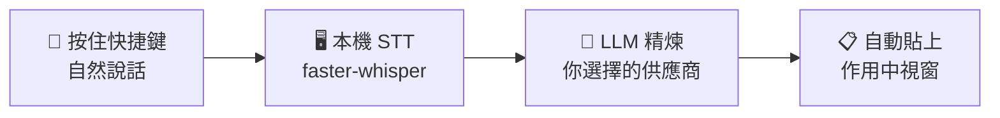

<div align="center">


# VOVOCI

**說出你的想法，邊說邊打磨。**

自然說話，在目前使用的桌面應用程式中取得乾淨、潤飾過的文字 — 由本機 STT 與你選擇的 LLM 驅動。

[](https://github.com/lovemage/vovoci/releases)
[](./LICENSE)
[](https://github.com/lovemage/vovoci)
[](https://github.com/lovemage/vovoci/releases)

Languages: [English](README.md) | [繁體中文](README.zh-TW.md) | [简体中文](README.zh-CN.md) | [日本語](README.ja.md) | [한국어](README.ko.md)

</div>

## 為什麼要結構化語音？

說話會啟動一種不同的思考方式 — 你會探索想法、發現漏洞，並即時修正方向。VOVOCI 把這些原始思考轉化為乾淨的結構化輸出，讓你可以：

- **邊說邊想** — 語音將思緒外化，幫助大腦比純打字更快地處理和精煉想法
- **掌握方向** — 聽到自己的推理過程，發現哪裡不對，在句子說到一半時就調整開發方向
- **直送任何場景** — 結構化輸出直接流入你的 IDE、agent prompt、筆記或聊天視窗 — 不需要額外整理

## 運作方式


```mermaid
graph LR
    A[🎤 按住快捷鍵 <br> 自然說話] --> B[🖥️ 本機 STT <br> faster-whisper]
    B --> C[🤖 LLM 精煉 <br> 你選擇的供應商]
    C --> D[📋 自動貼上 <br> 作用中視窗]
```

> 本機轉錄。你自己的 API key。在 LLM 步驟之前，資料不會離開你的電腦 — 而且你可以選擇信任哪個供應商。

## 亮點

| 💰 API 成本可選 | 📖 術語掃描器 | 🪟 語音結束檢視視窗 |
|:---:|:---:|:---:|
| 不用訂閱。你可以使用付費網路 LLM API、免費額度供應商，或本地 OpenAI-compatible 大模型服務；不強制接入付費的網路 API。 | 把內建 prompt 複製到你的 AI agent — 它會掃描你的程式碼庫並匯出詞彙表。匯入後，每次聽寫都能用正確的拼寫。 | 語音結束時可彈出檢視視窗：左側顯示原始輸入語言轉錄，右側顯示 AI 重組後的語意內容，方便貼上或複製前確認。 |

## v0.1.7 新功能

- **浮動錄音按鈕** — 關閉主視窗到系統匣後選擇 `Show Button`；點一下鳥圖示開始錄音，再點一下停止、轉錄並 Refi。
- **原地儲存設定** — `Save Settings` 只顯示儲存完成，不再收合設定區或跳到 History。
- **保留原意的 Refi** — 問句維持問句、陳述句維持陳述句，只有真正包含多個項目時才使用列表。
- **三平台 Release** — 同一套 GitHub workflow 自動產生 Windows、macOS 與 Linux 發佈檔案。

## 快速開始

### Linux 備註

- `Linux` 為 Linux 平台版本（不是 `Lanus`）。
- 應用程式現在會自動儲存並在下次啟動時自動載入「目前選擇的模型」，不需每次重選。

### 發佈檔案

| 平台 | 檔案 | Release | 使用方式 |
|:---|:---|:---|:---|
| Windows | `VOVOCI-portable-0.1.7.zip` 或 `VOVOCI-Setup-0.1.7.exe` | [vovoci/releases/latest](https://github.com/lovemage/vovoci/releases/latest) | 解壓 ZIP 並執行首次啟動程式，或直接執行安裝程式。 |
| macOS | `VOVOCI-macOS-0.1.7-unsigned.dmg` | [vovoci/releases/latest](https://github.com/lovemage/vovoci/releases/latest) | 將 `VOVOCI.app` 拖到 `Applications`；若 Gatekeeper 擋住，請右鍵選擇「打開」。 |
| Linux x86_64 | `VOVOCI-Linux-0.1.7-x86_64.tar.gz` | [vovoci/releases/latest](https://github.com/lovemage/vovoci/releases/latest) | 解壓後執行 `VOVOCI/VOVOCI`；桌面環境可能仍需安裝輸入輔助工具。 |

### 維護者發佈流程

當本地變更準備更新到遠端 release 與網站時，使用以下流程：

1. 將 source 變更 commit 並 push 到 `lovemage/vovoci`，必須包含 `site/` 與全部語言 README。
2. 確認 Cloudflare Pages 已設定從推送分支的 `site/` 部署靜態網站，或到 Cloudflare dashboard 手動觸發 Pages 部署。
3. 推送對應版本 tag（例如 `v0.1.7`），或手動執行 `release` workflow 並填入 `release_version=0.1.7`。
4. Workflow 會檢查 `APP_VERSION`、執行測試、編譯三個平台，並發佈到 `lovemage/vovoci` Releases。
5. 確認 Release 內含 Windows 安裝程式與免安裝 ZIP、macOS DMG、Linux x86_64 壓縮檔，再確認 `https://vovoci.com` 已顯示最新網站。

### 免安裝版（推薦）

1. 從 [Releases](https://github.com/lovemage/vovoci/releases/latest) 下載 `VOVOCI-portable-0.1.7.zip`
2. 解壓縮後執行 `Run-VOVOCI-First-Time.cmd`
3. 啟動 `VOVOCI.exe`

> STT 模型在首次使用時自動下載（需要一次網路連線），之後會快取在本機供離線使用。

### 從原始碼安裝

```powershell
git clone https://github.com/lovemage/vovoci.git
cd vovoci
python -m venv .venv && .venv\Scripts\activate
pip install -r requirements.txt
python app.py
```

## 供應商

VOVOCI 內建支援六個 LLM 供應商，也支援本機 OpenAI-compatible 模型服務 — 你永遠不會被綁定。

**OpenAI Compatible** · **OpenRouter** · **Xiaomi MiMo** · **Google Gemini** · **NVIDIA NIM** *（免費方案）* · **Local Model**

> 已經有自己的本地大模型服務？選擇 Local Model，填入本機 API Base URL、模型名稱，以及伺服器需要時才填 API Key。這可讓你使用本地大模型，不必強制接入付費網路 API。

## 應用程式截圖


<div align="center">

🌐 [官方網站](https://vovoci.com) · 📄 [Apache 2.0 License](./LICENSE)

</div>
